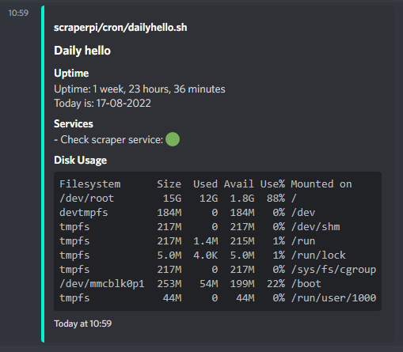

# Rnotify - Notification manager written in rust #
Rnotify sends notifications to various platforms, such as discord and telegram.

Rnotify reads a configuration file in the home directory, `.rnotify.toml`, using the [toml](https://toml.io/) configuration format.

## Basic Usage ##
Send a (info) notification to all configured destinations  
```console
rnotify -m "Message to send"
```

Send a notification with a title and level
```console
rnotify -t "Title" -l warn -m "Message to send"
```

Send an error notification using stdin as message

```console
echo "hi" | rnotify -t "Title" -l error
```

## Advanced usage ##
For more detailed notifications we can use formatted option `-f`.
This allows parsing of sections formatted on a line as `#<Section Name>#`
*The variables in the echo are created with simple shell commands*
```console
echo "
#<Uptime>#
Uptime: $uptime
Today is: $today
#<Services>#
- Check scraper service: $checkerservicestatus
#<Disk Usage>#
\`\`\`$diskspace\`\`\`" | rnotify -t "Daily hello" -a "cron/dailyhello.sh" -f
```

Using the formatting option of rnotify, we can create something like this:


## Configuration file format ##

Example configuration format that logs to a file and sends notifications to discord.
```toml
[[destinations]]
root = true
type = "File"
path = "/var/log/rnotify.log"

[[destinations]]
type = "Discord"
url = "https://discord.com/api/webhooks/.../..."
[[destinations.notify]]
min_level = "Warn"
notify = "<@309009265732091904>" # Notify this user, if the notification level is above a warning.
```
